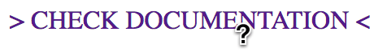

# Question 1
Areas addressed: HTML/CSS, CSS, SELECTORS, STYLING

## Styling Links

Write CSS so that link <a href="https://jaggaer.com">Check Documentation</a> and cursor looks like:



HTML5, CSS3
```
<!DOCTYPE html>
<html>
  <head>
    <meta charset="utf-8">
    <title>Styling links</title>
    <style type="text/css">
      /* Write your CSS solution here (do not edit the surrounding HTML) */
    </style>
  </head>
  <body>
    <a href="https://jaggaer.com">Check documentation</a>
  </body>
</html>
```
