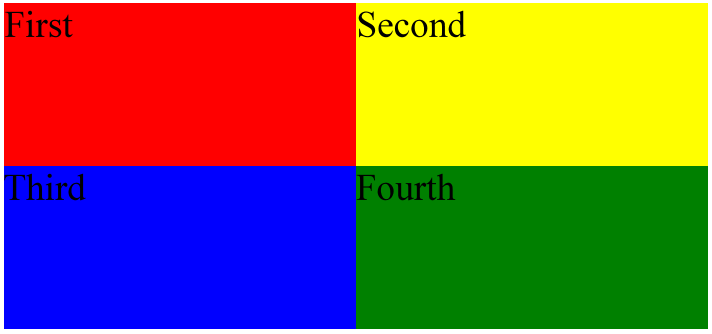

# Question 1
Areas addressed: HTML/CSS, CSS, SELECTORS, POSITIONING

## Articles

Using CSS only (without adding additional HTML attributes), style articles so that they occupy the whole browser window and have the following properties:

ARTICLE	| POSITION | BACKGROUND COLOR
--------|----------|-------------------
First   | Upper-left quarter  | Red
Second	| Upper-right quarter |	Yellow
Third	| Lower-left quarter  |	Blue
Fourth	|Lower-right quarter  |	Green



HTML5, CSS3
```
<!DOCTYPE html>
<html>
<head>
  <meta charset="utf-8">
  <title>Articles</title>
  <style>
    /* Write your CSS solution here (do not edit the surrounding HTML) */
  </style>
</head>
<body>
  <article>First</article>
  <article>Second</article>
  <article>Third</article>
  <article>Fourth</article>
</body>
</html>
```